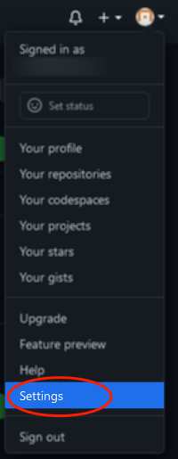
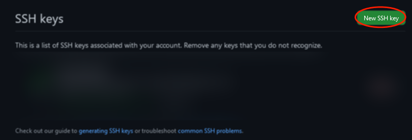
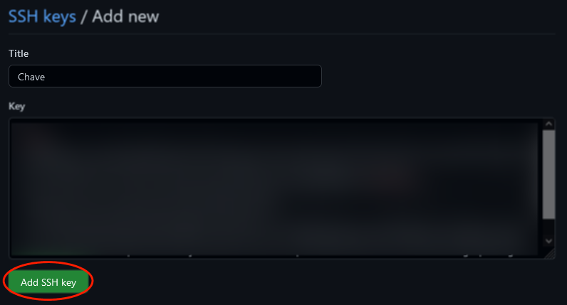
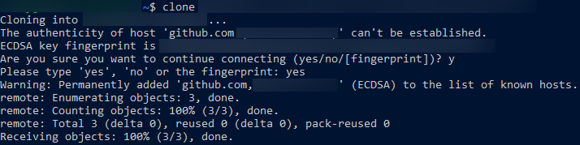

<div align="center"><h1> ComoGerarChaveSSH </h1></div>

<div align="center"><h4>Antes de começar. Verifique se possue o diretório .ssh em sua home</h4></div>

```bash
$> ls -a ~/
.ssh/
```
Se possuir o diretório siga para [Pegar Chave](#pegar-a-chave). Caso contrário siga para [Gerar Chave ssh](#gerar-chave-ssh)

</br>
</br>
</br>
</br>
</br>
</br>
</br>
</br>
</br>

## Pegar a Chave
- [Inicio](#-comogerarchavessh-)
</br>

Com o diretório criado. Use o comando:
```bash
$> cat ~/.ssh/id_rsa.pub >> Chave.txt
```
**ou**
```bash
$> cat ~/.ssh/id_ed25519.pub >> Chave.txt
```
Tudo o que estiver dentro do arquivo é sua chave ssh.
Já pode seguir para o passo [Incluir Chave no GitHub](#incluir-chave-no-github)

</br>
</br>
</br>
</br>
</br>
</br>
</br>
</br>
</br>
</br>

## Gerar Chave SSH
- [Inicio](#-comogerarchavessh-)
</br>

Na home de seu sistema execute:

```bash
$> ssh-keygen -t rsa -b 4096 -C "your_email@example.com"
```
Aperte *Enter* 3 vezes.
</br>
Não ha a necessidade de incluir o file ou a frase.
```bash
$> eval $(ssh-agent -s)
$> ssh-add ~/.ssh/id_rsa
```
Com esses comandos você criou o diretório .ssh/ e gerou sua chave. Pode siguir para [Pegar Chave](#pegar-a-chave).

</br>
</br>
</br>
</br>
</br>
</br>
</br>
</br>
</br>

## Incluir Chave no GitHub
- [Inicio](#-comogerarchavessh-)
</br>

Para incluir sua chave no github
</br>
- Acesse suas configurações no site.
</br>


#
- Nas configurações, acesse *"SSH e GPG keys"*
- Em seguida aperte em nova chave ssh
</br>


#
- Por fim cole na aba *key* o conteúdo do seu arquivo *chave.txt*. E dê um titulo a sua chave.
</br>


#
- Ao clonar um repositório pela primeira vez, com o link ssh, ele perguntará se quer se manter conectado.
- Apenas digite *"yes"*
</br>




#
**Para um tutorial mais Completo acesse**
```zsh
https://dev.to/dxwebster/como-conectar-ao-github-com-chaves-ssh-1i41
```
